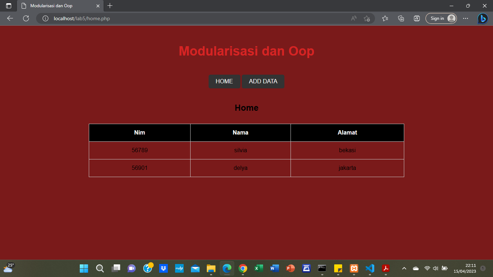
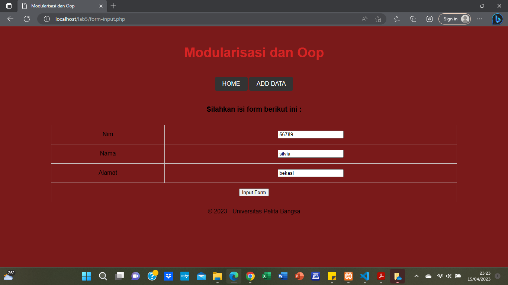

# Praktikum 5 - PHP OOP

### Persiapan

1. Persiapkan text editor misalnya VSCode.
2. Buat folder baru dengan nama lab5_php_oop pada docroot webserver **(htdocs)**.

### Langkah Praktikum

1. Buat file baru dengan nama **mobil.php**.

```
<?php
/**
* Program sederhana pendefinisian class dan pemanggilan class.
**/
class Mobil
{
    private $warna;
    private $merk;
    private $harga;

    public function __construct($warna, $merk, $harga)
    {
        $this->warna = $warna;
        $this->merk = $merk;
        $this->harga = $harga;
    }

    public function getWarna()
    {
        return $this->warna;
    }

    public function setWarna($warna)
    {
        $this->warna = $warna;
    }

    public function getMerk()
    {
        return $this->merk;
    }

    public function setMerk($merk)
    {
        $this->merk = $merk;
    }

    public function getHarga()
    {
        return $this->harga;
    }

    public function setHarga($harga)
    {
        $this->harga = $harga;
    }

    public function tampilWarna()
    {
        echo "Warna mobilnya: " . $this->warna;
    }
}

// membuat objek mobil
$a = new Mobil("Biru", "BMW", 10000000);
$b = new Mobil("Merah", "Toyota", 5000000);

// memanggil objek
echo "Mobil a: warna " . $a->getWarna() . ", merk " . $a->getMerk() . ", harga " . $a->getHarga() . "<br>";
echo "Mobil b: warna " . $b->getWarna() . ", merk " . $b->getMerk() . ", harga " . $b->getHarga() . "<br>";

// mengubah warna mobil a
$a->setWarna("Hitam");

// memanggil objek setelah diubah warna nya
echo "Mobil a: warna " . $a->getWarna() . ", merk " . $a->getMerk() . ", harga " . $a->getHarga() . "<br>";
?>
```

2. Membuat class library dengan membuat file baru dengan nama **form.php**. 
    * Class library merupakan pustaka kode program yang dapat digunakan bersama pada beberapa file yang berbeda (konsep modularisasi). Class library menyimpan fungsi-fungsi atau class object komponen untuk memudahkan dalam proses development aplikasi.

```
    <?php
    /**
    * Nama Class: Form
    * Deskripsi: CLass untuk membuat form inputan text sederhana
    **/
    class Form
    {
        private $fields = array();
        private $action;
        private $submit = "Submit Form";
        private $jumField = 0;
        
        public function __construct($action, $submit)
        {
            $this->action = $action;
            $this->submit = $submit;
        }

        public function displayForm()
        {
            echo "<form action='".$this->action."' method='POST'>";
            echo '<table width="100%" border="0">';
            for ($j=0; $j<count($this->fields); $j++) {
            echo "<tr><td align='right'>".$this->fields[$j]['label']."</td>";
            echo "<td><input type='text' name='".$this->fields[$j]['name']."'></td></tr>";
            }
            echo "<tr><td colspan='2'>";
            echo "<input type='submit' value='".$this->submit."'></td></tr>";
            echo "</table>";
        }
        
        public function addField($name, $label)
        {
            $this->fields [$this->jumField]['name'] = $name;
            $this->fields [$this->jumField]['label'] = $label;
            $this->jumField ++;
        }
    }
    ?>
```

3. Mengimplementasikan pemanggilan class library **form.php**.
    * Membuat file baru dengan nama **form_input.php**.
    
    ```
        <?php require('header.php'); ?>
        <?php
        /**
        * Program memanfaatkan Program 10.2 untuk membuat form inputan sederhana.
        **/
        include "form.php";
        include "database.php";
        
        echo "<html><head><title>Mahasiswa</title></head><body>";
        $form = new Form("","Input Form");
        $form->addField("txtnim", "Nim");
        $form->addField("txtnama", "Nama");
        $form->addField("txtalamat", "Alamat");
        echo "<h3>Silahkan isi form berikut ini :</h3>";
        $form->displayForm();

        // Menyimpan data ke database
        if ($_SERVER['REQUEST_METHOD'] == 'POST') {
        $nim = $_POST['txtnim'];
        $nama = $_POST['txtnama'];
        $alamat = $_POST['txtalamat'];
        $db = new Database();
        $data = array(
            "nim" => $nim,
            "nama" => $nama,
            "alamat" => $alamat
        );
        $result = $db->insert("mahasiswa", $data);
        if ($result === false) {
            echo "Error: Gagal menyimpan data";
        } else {
            echo "Data berhasil disimpan";
        }
    }
    echo "</body></html>";
    ?>

    <?php require('footer.php'); ?>
    ```

    * Membuat file dengan nama **database.php** untuk database connection dan query. 

    ```
    <?php
    
    class Database {
        protected $host;
        protected $user;
        protected $password;
        protected $db_name;
        protected $conn;
    
        public function __construct() {
            $this->getConfig();
            $this->conn = new mysqli($this->host, $this->user, $this->password, $this->db_name);
        if ($this->conn->connect_error) {
            die("Connection failed: " . $this->conn->connect_error);
            }
        }
    
    private function getConfig() {
        $config = include("config.php");
        $this->host = $config['host'];
        $this->user = $config['username'];
        $this->password = $config['password'];
        $this->db_name = $config['db_name'];
    }
    
    public function query($sql) {
        return $this->conn->query($sql);
    }
    
    public function get($table, $where=null) {
        if ($where) {
            $where = " WHERE ".$where;
        }
        $sql = "SELECT * FROM ".$table.$where;
        $sql = $this->conn->query($sql);
        $sql = $sql->fetch_assoc();
        return $sql;
    }
    
    public function insert($table, $data) {
        $columns = array();
        $values = array();
        if (is_array($data) && count($data) > 0) {
            foreach($data as $key => $val) {
                $columns[] = $key;
                $values[] = "'".$this->conn->real_escape_string($val)."'";
            }
            $columns = implode(",", $columns);
            $values = implode(",", $values);
            $sql = "INSERT INTO ".$table." (".$columns.") VALUES (".$values.")";
            $result = $this->conn->query($sql);
            if ($result === false) {
                die("Error: ".$this->conn->error);
            } else {
                return $result;
            }
        } else {
            return false;
        }
    }
    
    public function update($table, $data, $where) {
        $update_value = array(); // Ubah dari string kosong menjadi array kosong
        if (is_array($data)) {
            foreach($data as $key => $val) {
                $update_value[] = "$key='{$val}'";
            }
            $update_value = implode(",", $update_value);
        }
        $sql = "UPDATE ".$table." SET ".$update_value." WHERE ".$where;
        $sql = $this->conn->query($sql);
        if ($sql == true) {
            return true;
        } else {
            return false;
        }
    }
    
    public function delete($table, $filter) {
        $sql = "DELETE FROM ".$table." ".$filter;
        $sql = $this->conn->query($sql);
        if ($sql == true) {
            return true;
        } else {
            return false;
        }
    }
    }
    ?>
    ```

### Screenshot Hasil







### Terima kasih !